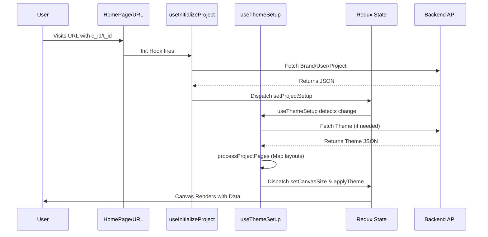

# Photo Editor Codebase Analysis

## File Mapping & Responsibilities

| File Path | Role | Description |
| :--- | :--- | :--- |
| `src/library/utils/custom-hooks/useInitializeProject.js` | **Entry Point** | App hydration. Fetches brand, user, and project data from URL params. |
| `src/library/utils/custom-hooks/useThemeSetup.js` | **Theme Orchestrator** | Reacts to project setup. Manages theme fetching and page processing. |
| `src/store/slices/canvas.js` | **State Brain** | Manages pages, objects, and dimensions with undo/redo history. |
| `src/store/slices/projectSetup.js` | **Project Manager** | Stores global metadata (User details, Cart/Theme info). |
| `src/store/slices/svgData.js` | **Export Pipeline** | Tracks SVG capture progress and print file generation. |
| `src/components/canvas/Canvas.jsx` | **Rendering Engine** | Core SVG renderer. Handles drag-and-drop and marquee selection. |
| `src/layout/Header.jsx` | **Global Actions** | Coordinates saving, ordering, and global editor settings. |
| `src/library/utils/services/theme/index.js` | **Business Logic** | `processProjectPages` logic for theme/layout application. |

## Architecture Overview

### Core Layers

1.  **State Layer (Redux)**:
    *   `canvas`: The "brain" of the editor. Manages pages, objects, dimensions, and undo/redo history.
    *   `projectSetup`: Manages initial data (User, Brand, Project details).
    *   `svgData`: Handles the export pipeline (SVG capture, PDF generation state).
    *   `appSlice`: UI state (modals, panels, active tools).

2.  **Logic Layer (Hooks)**:
    *   `useInitializeProject`: Hydrates the app from URL parameters and API data.
    *   `useThemeSetup`: Handles the transition from a "Project" to a "Theme-ready" state.
    *   `useExportPages`: Orchestrates the multipart SVG capture process.

3.  **Presentation Layer (Components)**:
    *   `Canvas`: High-performance SVG renderer for pages.
    *   `Header`: Global action coordinator (Save, Order, Settings).
    *   `Popups`: Context-aware configuration (SizeSettings, ExportOptions).

---

## State Management Details

### Canvas Slice (`src/store/slices/canvas.js`)
*   **Undo/Redo**: Wrapped in `redux-undo`. Almost every object manipulation is trackable.
*   **Page Management**: Handles dynamic page addition/deletion, cover sheet logic, and "Billable Pages" calculation.
*   **Layout Logic**:
    *   **Photobooks**: Calculates `spineWidth` based on `paperThickness` and page count.
    *   **Spreads**: Manages `layout[0]` (back/left) and `layout[1]` (front/right) for seamless full-wrap covers.
*   **Smart Text**: Specialized synchronization logic (`propagateTextGroupValue`) to update text across all pages simultaneously.

### Persistence Strategy
*   **Compression**: Large JSON payloads (`pages`) are compressed using `lz-string` before being sent to the backend as `pages_c`.
*   **SVG Capture**: To generate previews and final print files, the app sequentially renders every page in the background and serializes the DOM to SVG strings.

---

## Data Flow: Initialization

---

## Key Components

### `Canvas.jsx`
*   **Rendering**: Uses standard React components (`Photo`, `Text`, `Sticker`) to render SVG `<g>` elements.
*   **Interaction**: Implements custom marquee selection and touch-based multi-select.
*   **Export**: Contains the "Background Renderer" logic that switches pages and captures SVGs for the print engine.

### `Header.jsx`
*   **Save/Order Flow**:
    1.  Captures current page SVG for preview.
    2.  Assembles full JSON payload.
    3.  Compresses via `lz-string`.
    4.  Submits to `saveProject` or `orderProject` endpoints.

---

## Performance Considerations
*   **Memoization**: Extensive use of `useMemo` and `useCallback` in the Canvas to prevent per-frame re-renders.
*   **Incremental Capture**: The export system yields to the main thread (`yieldToMainThread`) between page captures to prevent browser hangs during large photobook exports (100+ pages).

<!-- DOCS-INDEX:START -->
---

## 📚 All Documentation

> Every doc in `docs/` links to all the others. Session/performance docs (dated) also ship a styled `.html` twin.

- 🏛️ [Architecture](architecture.md)
- 🔍 **Codebase Analysis** — _you are here_
- 🔀 [Data Flow Diagram](data-flow-diagram.md)
- 🖌️ [Canvas](canvas.md)
- ✋ [Interaction](interaction.md)
- 📷 [Photo](photo.md)
- 🔷 [Shape](shape.md)
- ⭐ [Sticker](sticker.md)
- 🔤 [Text](text.md)
- 📱 [React Native Migration Plan](react-native-migration-plan.md)
- ⬆️ [Upload Pipeline](upload-pipeline.md)
- 📝 [Session: Upload Pipeline Rework (2026-06-12)](session-2026-06-12-upload-pipeline-rework.md)
- 🖼️ [Image Loading Optimization (2026-06-16)](image-loading-optimization-2026-06-16.md)
- 🎯 [Canvas Interaction Performance (2026-06-16)](canvas-interaction-performance-2026-06-16.md)
- 📐 [Resize Imperative Performance (2026-06-16)](resize-imperative-performance-2026-06-16.md)
- 🅿️ [Photobook Full Cover Sync (2026-06-19)](photobook-full-cover-sync-2026-06-19.md)
- 🗂️ [Photos Gallery Order & Preview (2026-06-19)](photos-gallery-order-and-preview-2026-06-19.md)
- 💾 [Customer Auto-Save Activity Gate (2026-06-19)](customer-autosave-activity-gate-2026-06-19.md)
- 📏 [Canvas Rulers (2026-06-24)](canvas-rulers-2026-06-24.md)
<!-- DOCS-INDEX:END -->
