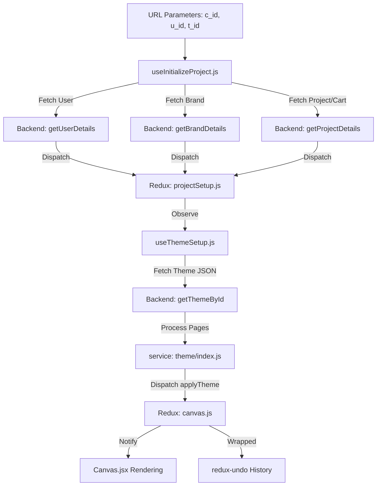
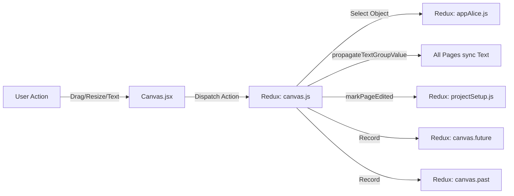
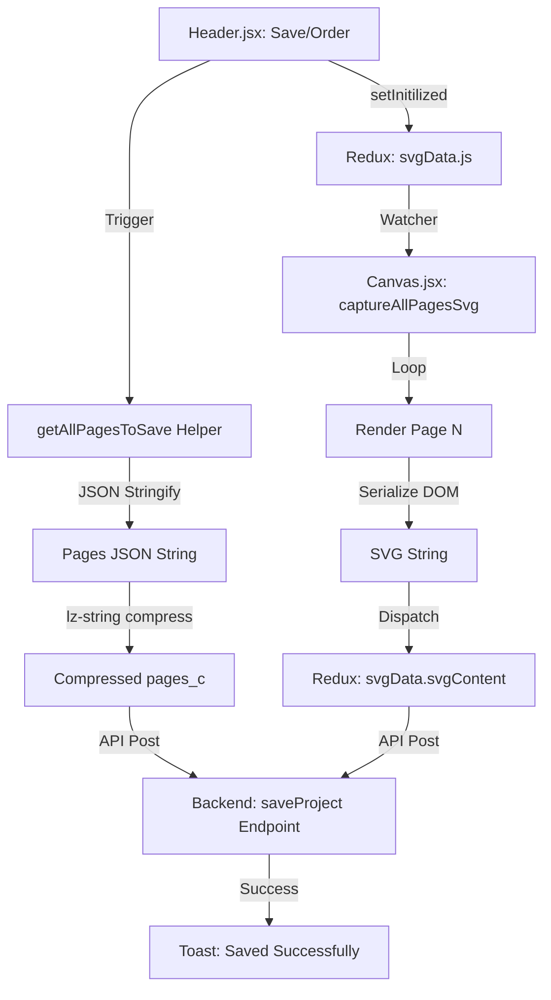
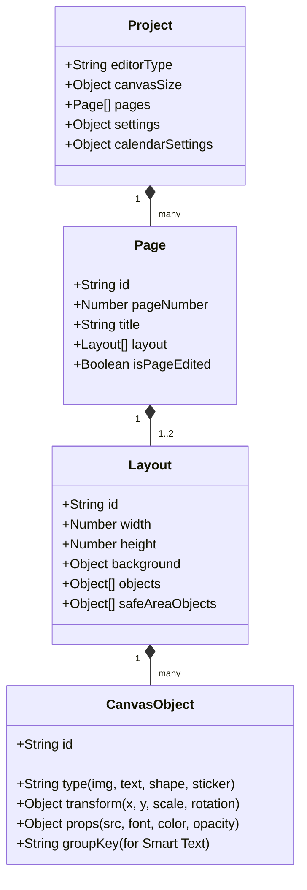

# Photo Editor Data Flow Diagram

This document illustrates the end-to-end data flow within the Photo Editor, from initialization to project export.

## Initialization & Theme Application

The following diagram tracks how a user visits the editor and how product data is hydrated into the Redux state.

---

## Editor Interaction & State Synchronization

How user actions on the canvas reach the Redux store and other components.

---

## Final Project Save & Export Pipeline

The complex process of serializing data for persistence and print generation.

## Architectural Visual Map

---

## Object Hierarchy (JSON Structure)

A high-level view of how a single `page` is structured in the Redux store.

<!-- DOCS-INDEX:START -->
---

## 📚 All Documentation

> Every doc in `docs/` links to all the others. Session/performance docs (dated) also ship a styled `.html` twin.

- 🏛️ [Architecture](architecture.md)
- 🔍 [Codebase Analysis](codebase-analysis.md)
- 🔀 **Data Flow Diagram** — _you are here_
- 🖌️ [Canvas](canvas.md)
- ✋ [Interaction](interaction.md)
- 📷 [Photo](photo.md)
- 🔷 [Shape](shape.md)
- ⭐ [Sticker](sticker.md)
- 🔤 [Text](text.md)
- 📱 [React Native Migration Plan](react-native-migration-plan.md)
- ⬆️ [Upload Pipeline](upload-pipeline.md)
- 📝 [Session: Upload Pipeline Rework (2026-06-12)](session-2026-06-12-upload-pipeline-rework.md)
- 🖼️ [Image Loading Optimization (2026-06-16)](image-loading-optimization-2026-06-16.md)
- 🎯 [Canvas Interaction Performance (2026-06-16)](canvas-interaction-performance-2026-06-16.md)
- 📐 [Resize Imperative Performance (2026-06-16)](resize-imperative-performance-2026-06-16.md)
- 🅿️ [Photobook Full Cover Sync (2026-06-19)](photobook-full-cover-sync-2026-06-19.md)
- 🗂️ [Photos Gallery Order & Preview (2026-06-19)](photos-gallery-order-and-preview-2026-06-19.md)
- 💾 [Customer Auto-Save Activity Gate (2026-06-19)](customer-autosave-activity-gate-2026-06-19.md)
- 📏 [Canvas Rulers (2026-06-24)](canvas-rulers-2026-06-24.md)
<!-- DOCS-INDEX:END -->
